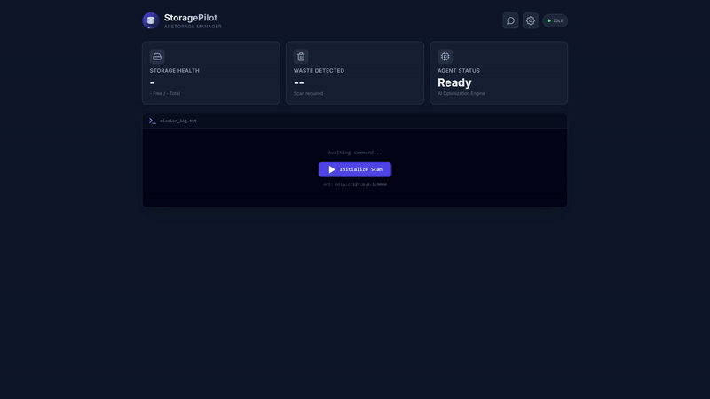

<p align="center">
  
</p>

<h1 align="center">StoragePilot</h1>

<p align="center">
  <strong>AI-Powered Storage Lifecycle Manager</strong><br>
  Multi-agent system for intelligent storage analysis and optimization
</p>

<p align="center">
  <a href="#installation">Installation</a> •
  <a href="#quick-start">Quick Start</a> •
  <a href="#features">Features</a> •
  <a href="#configuration">Configuration</a> •
  <a href="#architecture">Architecture</a>
</p>

---

## Overview

StoragePilot is an enterprise-grade storage management solution that uses AI agents to analyze, classify, and optimize file storage. Built with CrewAI, it understands developer context—distinguishing active projects from abandoned artifacts.

**Key Benefits:**
- Zero-config local LLM support
- Safe dry-run mode by default
- Developer-aware artifact detection
- Automated file classification and organization




---

## Installation

### Option 1: pip install (Recommended)

```bash
pip install storagepilot
```

After installation, run the setup to install Ollama and default model:

```bash
storagepilot --setup
```

### Option 2: From Source

#### Prerequisites
- Python 3.10+
- 4GB RAM minimum

#### One-Command Setup

```bash
git clone https://github.com/ruslanmv/StoragePilot.git
cd StoragePilot
make install
```

This installs:
- Python dependencies
- Ollama (local LLM runtime)
- Default model (`qwen2.5:0.5b`, ~400MB)

#### Manual Installation

```bash
# Install dependencies
pip install -r requirements.txt

# Install Ollama
./scripts/setup_ollama.sh

# Or use cloud providers (set API keys)
export OPENAI_API_KEY=your-key
```


---

## Quick Start

```bash
# Run in safe preview mode (CLI)
make run

# Launch web dashboard (React UI)
make api

# Run all tests
make test-api
```

If installed via pip:

```bash
# Run in safe preview mode
storagepilot --dry-run

# Scan current directory
storagepilot --scan-only

# Execute with actions
storagepilot --execute
```

---

## Makefile Commands

Run `make help` to see all available commands:

### Installation
| Command | Description |
|---------|-------------|
| `make install` | Full install (deps + Ollama + model) |
| `make install-deps` | Install Python dependencies only |
| `make install-ollama` | Install Ollama (local LLM runtime) |
| `make install-model` | Pull the default model |
| `make install-model MODEL=llama3` | Pull a specific model |

### Web Dashboard (React UI)
| Command | Description |
|---------|-------------|
| `make api` | Start dashboard (dev mode with auto-reload) |
| `make api-prod` | Start dashboard (production mode) |

The dashboard will be available at: **http://127.0.0.1:8000**

### CLI Commands
| Command | Description |
|---------|-------------|
| `make run` | Run StoragePilot CLI (dry-run mode) |
| `make run-execute` | Run StoragePilot CLI (execute mode) |
| `make run-scan` | Run scan only (no AI analysis) |

### Testing
| Command | Description |
|---------|-------------|
| `make test` | Verify Ollama is working |
| `make test-api` | Run API unit tests |
| `make test-all` | Run all tests with coverage |

### MCP Server (Model Context Protocol)
| Command | Description |
|---------|-------------|
| `make mcp-server` | Start MCP server (dry-run, stdio transport) |
| `make mcp-server-execute` | Start MCP server (execute mode) |
| `make mcp-inspector` | Launch MCP Inspector UI (test/debug tools) |
| `make mcp-dev` | Start server with MCP dev mode |
| `make mcp-list` | List all available MCP tools |

### Utilities
| Command | Description |
|---------|-------------|
| `make clean` | Clean up generated files |
| `make help` | Show all available commands |

### Model Options
```bash
make install-model MODEL=qwen2.5:0.5b   # Smallest (~400MB)
make install-model MODEL=llama3.2:1b   # Small (~1GB)
make install-model MODEL=llama3        # Medium (~4GB)
make install-model MODEL=mistral       # Good balance (~4GB)
```

---

## Features

### Storage Analysis
| Feature | Description |
|---------|-------------|
| **Directory Scanning** | Size breakdown, large file detection |
| **Developer Artifacts** | Detects `node_modules`, `.venv`, `__pycache__`, build dirs |
| **Docker Analysis** | Images, containers, volumes, build cache |
| **Duplicate Detection** | Content-hash and filename-pattern matching |

### File Classification
| Category | Actions |
|----------|---------|
| Documents | Organize by type (invoices, contracts, tax) |
| Images | Sort screenshots, photos, memes |
| Code/Data | Move to workspace directories |
| Installers | Mark for cleanup |
| Archives | Analyze contents |

### Safety
- **Dry-run by default** — Preview before execution
- **Approval gates** — Confirm destructive actions
- **Backup support** — Optional pre-delete backups
- **Undo logging** — Track all actions for rollback
- **Protected paths** — Never touches `.ssh`, `.gnupg`, `.aws`

---

## Configuration

Edit `config/config.yaml`:

```yaml
# LLM Provider
llm:
  provider: "ollama"           # ollama | openai | anthropic | matrixllm
  model: "qwen2.5:0.5b"
  base_url: "http://127.0.0.1:11434/v1"

# Scan Targets
scan_paths:
  primary:
    - "."                      # Current directory
    - "~/Downloads"
    - "~/Desktop"
  workspace:
    - "~/workspace"
    - "~/projects"

# Safety Settings
safety:
  dry_run: true
  require_approval: true
  backup_before_delete: true
```

### LLM Providers

| Provider | Setup | Use Case |
|----------|-------|----------|
| `ollama` | `make install` | Local inference, no API keys |
| `matrixllm` | `--pair-matrixllm` | Custom LLM gateway |
| `openai` | `OPENAI_API_KEY` | Cloud inference |
| `anthropic` | `ANTHROPIC_API_KEY` | Cloud inference |

---

## Architecture

```
┌───────────────────────────────────────────────────────────┐
│                      StoragePilot                         │
├───────────────────────────────────────────────────────────┤
│  ┌──────────┐  ┌──────────┐  ┌──────────┐  ┌──────────┐   │
│  │ Scanner  │→ │ Analyzer │→ │Organizer │→ │ Cleaner  │   │
│  │  Agent   │  │  Agent   │  │  Agent   │  │  Agent   │   │
│  └──────────┘  └──────────┘  └──────────┘  └──────────┘   │
│       ↓              ↓             ↓             ↓        │
│  ┌─────────────────────────────────────────────────────┐  │
│  │                    Tool Layer                       │  │
│  │  terminal.py │ classifier.py │ matrixllm.py         │  │
│  └─────────────────────────────────────────────────────┘  │
│       ↓              ↓             ↓             ↓        │
│  ┌─────────────────────────────────────────────────────┐  │
│  │              LLM Provider (Ollama/OpenAI)           │  │
│  └─────────────────────────────────────────────────────┘  │
└───────────────────────────────────────────────────────────┘
```

### Agents

| Agent | Role | Capabilities |
|-------|------|--------------|
| **Scanner** | Storage Detective | Disk usage, large files, Docker stats |
| **Analyzer** | AI Classifier | File classification, duplicate detection |
| **Organizer** | File Architect | Folder structure, move planning |
| **Cleaner** | Storage Liberator | Safe cleanup recommendations |
| **Reporter** | Insights Compiler | Summary reports |
| **Executor** | Action Manager | Execute with safety checks |

---

## MCP Server

StoragePilot includes an MCP (Model Context Protocol) server that exposes all storage management tools for use by LLM agents.

### Quick Start

```bash
# List all available tools
make mcp-list

# Launch MCP Inspector (visual testing UI)
make mcp-inspector

# Start server in dry-run mode
make mcp-server
```

### Available Commands

| Command | Description |
|---------|-------------|
| `make mcp-server` | Start MCP server (dry-run, stdio transport) |
| `make mcp-server-execute` | Start MCP server (execute mode - **caution!**) |
| `make mcp-inspector` | Launch MCP Inspector UI at http://localhost:5173 |
| `make mcp-dev` | Start with MCP CLI dev mode |
| `make mcp-list` | List all 15 available tools |

### MCP Inspector

The MCP Inspector is a visual tool to test and debug MCP servers:

```bash
make mcp-inspector
```

This will:
- Start the StoragePilot MCP server
- Launch a web UI at **http://localhost:5173**
- Let you visualize, test, and debug all tools

**Requirements:** Node.js 18+ (`npx` command)

### Available Tools

| Category | Tools |
|----------|-------|
| **Discovery** | `scan_directory`, `find_large_files`, `find_old_files`, `find_developer_artifacts` |
| **System** | `get_system_overview`, `get_docker_usage` |
| **Classification** | `classify_files`, `classify_single_file`, `detect_duplicates` |
| **Execution** | `move_file`, `delete_file`, `create_directory`, `clean_docker` |
| **Utility** | `calculate_file_hash`, `get_server_info` |

### Claude Desktop Integration

Add to your Claude Desktop config (`~/.config/claude/claude_desktop_config.json`):

```json
{
  "mcpServers": {
    "storagepilot": {
      "command": "python",
      "args": ["/path/to/StoragePilot/mcp_server.py", "--dry-run"]
    }
  }
}
```

For execute mode (allows actual file changes):
```json
{
  "mcpServers": {
    "storagepilot": {
      "command": "python",
      "args": ["/path/to/StoragePilot/mcp_server.py", "--execute"]
    }
  }
}
```

---

## MatrixLLM Setup (Optional)

For users who prefer a custom LLM gateway (e.g., MatrixShell ecosystem).

### How MatrixLLM Works

```text
┌─────────────────┐       ┌─────────────────┐       ┌─────────────────┐
│  StoragePilot   │──────▶│    MatrixLLM    │──────▶│   Backend LLM   │
│    (CrewAI)     │       │    (Gateway)    │       │  (deepseek-r1,  │
│                 │◀──────│   Port 11435    │◀──────│   llama, etc)   │
└─────────────────┘       └─────────────────┘       └─────────────────┘
         │                         │
         │    OpenAI-compatible    │
         │  /v1/chat/completions   │
         │                         │
         └─────────────────────────┘

```

### Setup Steps

#### 1. Start MatrixLLM Server

```bash
matrixllm start --auth pairing --host 127.0.0.1 --port 11435 --model deepseek-r1
```

#### 2. Pair StoragePilot (One-Time)

```bash
storagepilot --pair-matrixllm
```

This will:
- Prompt for the pairing code displayed by MatrixLLM.
- Exchange the code for a long-lived token.
- Save the token to `~/.config/storagepilot/matrixllm_token`.

```
┌─────────────────────────────────────┐
│  MatrixLLM Pairing                  │
│                                     │
│  Base URL: http://127.0.0.1:11435/v1│
│  Enter the pairing code shown by    │
│  MatrixLLM (--auth pairing mode).   │
├─────────────────────────────────────┤
│  Pairing code: 123456               │
│                                     │
│  ✓ Paired successfully.             │
│  Token saved to: ~/.config/...      │
└─────────────────────────────────────┘
```

#### 3. Run StoragePilot

```bash
storagepilot --dry-run
```
---

## License

Apache 2.0 License — Free for personal and commercial use.

---

<p align="center">
  <sub>Built with <a href="https://crewai.com">CrewAI</a> and <a href="https://ollabridge.com">OllaBridge</a></sub>
</p>
